# 01_02 Install Jenkins on Windows

Use these instructions to install Jenkins on a system running a Windows operating system.

## **Prerequisites**

Before installing Jenkins, make sure that the system has the following in place:

* A recent version of the Windows operating system (for example, Windows 11, Windows Server 2022-2025)
* At least **256 MB of RAM**
* At least **1 GB of drive space**

You should have **administrator privileges** to complete the installation.

## **Install Java 21 JDK**

Systems operating Jenkins must have a Java runtime environment installed.

The recommended version of Java for use with Jenkins is Java 21.  The Java Development Kit (JDK) version includes the Java runtime environment and additional development tools.

1. Download the [Microsoft Build of OpenJDK](https://learn.microsoft.com/en-us/java/openjdk/download#openjdk-21) for Windows x64:  [https://aka.ms/download-jdk/microsoft-jdk-21.0.6-windows-x64.msi](https://aka.ms/download-jdk/microsoft-jdk-21.0.6-windows-x64.msi)

    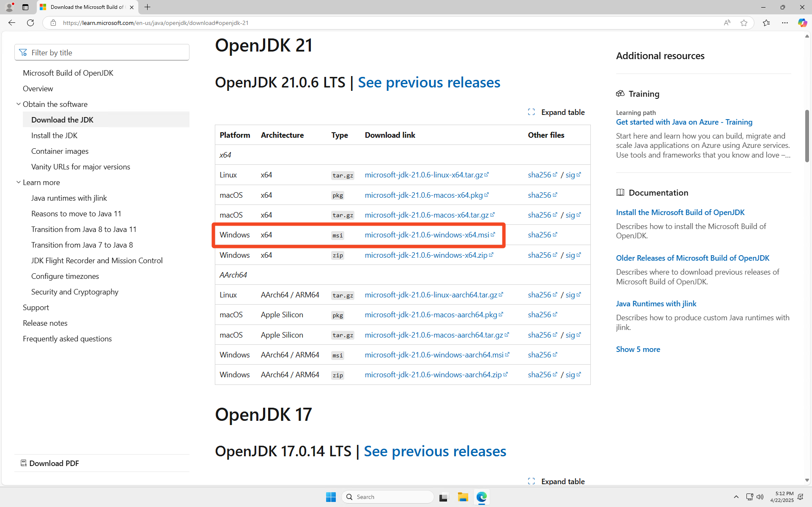

1. Open the installation package. Select **Next**.

    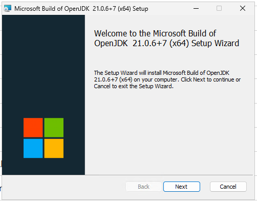

1. Accept the license agreement and select **Next**.

    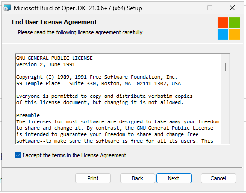

1. Select "**Install for all users of this machine**" and select **Next**.

    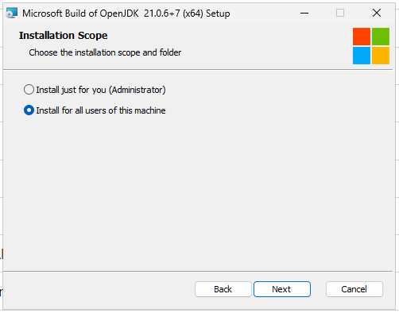

1. Select "**Set or override JAVA\_HOME variable**" and select **Next**.

    

1. Select **Install**.

    

1. When the installation completes, select **Finish**.

    

### **Install Git**

A `git` installation is required for Jenkins to connect to code repositories.

1. Download the latest version of the Git installer from the following link: [https://git-scm.com/downloads/win](https://git-scm.com/downloads/win)

    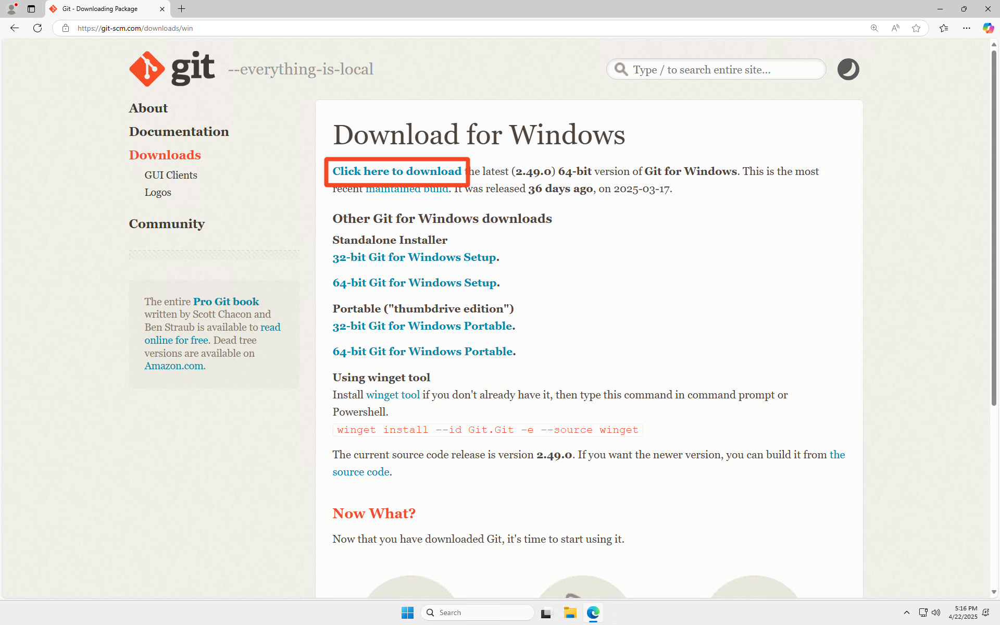

1. Open the installation package.
1. Accept all defaults and select **Next** on each screen of the installation dialog.

    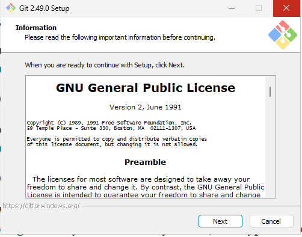

1. On the "Configuring extra options" screen, select **Install**.
1. When the installation completes, select **Finish**.

    

## **Install Jenkins**

1. Download the LTS version of Jenkins for Windows from the Jenkins download webpage: [https://www.jenkins.io/download/](https://www.jenkins.io/download/)

    

1. Open the installation package.  Select **Next**.

    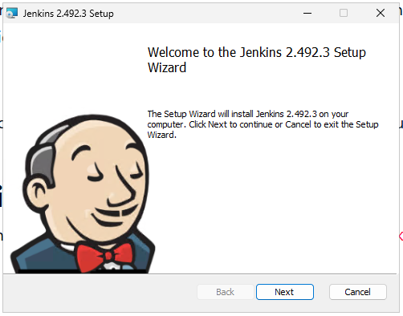

1. On the "Destination Folder" screen, select **Next**.

    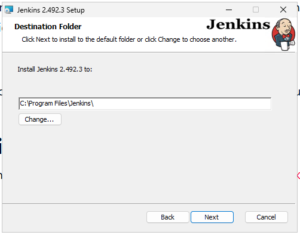

1. On the "Service Logon Credentials" screen, select "Run service as LocalSystem (not recommended)". Select **Next**. *NOTE: This option is acceptable for learning purposes in a controlled environment*.

    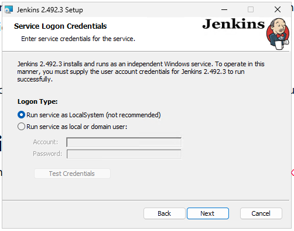

1. On  the "Port Selection" screen, select **Test Port**.  Select **Next**.  *NOTE: If the port test fails, check for other processes that are running on the system and using port `8080`.  Stop the other process or consider using a different port for Jenkins*.

    

    

1. On the "Select Java home directory" screen, select **Change...**.

    

1. Inside the "Program Files" directory, select "Microsoft"; then select "jdk-21.0.6.7-hotspot".

    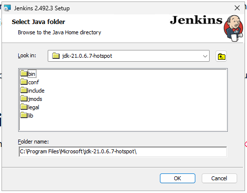

1. Select **OK** then select **Next**.

    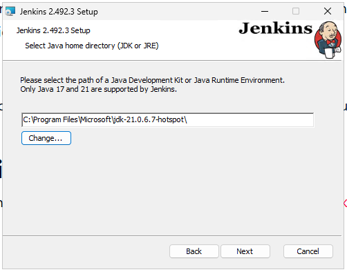

1. On the "Custom Setup" screen, select **Next**.

    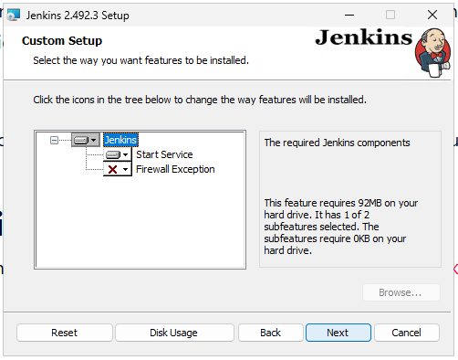

1. Select **Install**.

    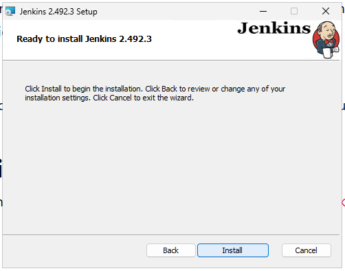

1. When the installation completes, select **Finish**.

    

1. Open a File Explorer window and browse to the following path: `C:\ProgramData\Jenkins\.jenkins\secrets\initialAdminPassword`

    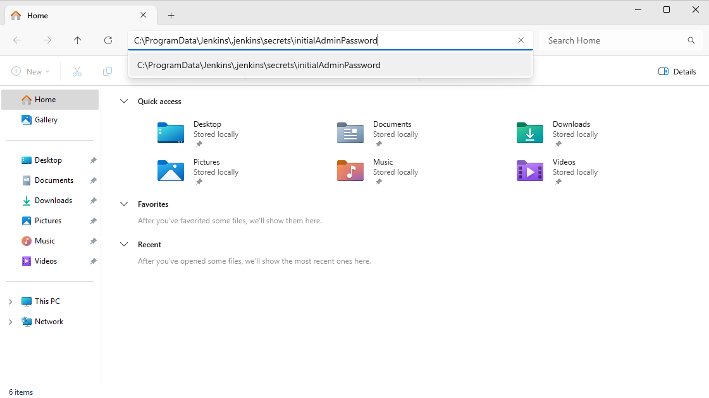

1. Select **Notepad** as the application to open the file.  Then select **Just once**.

    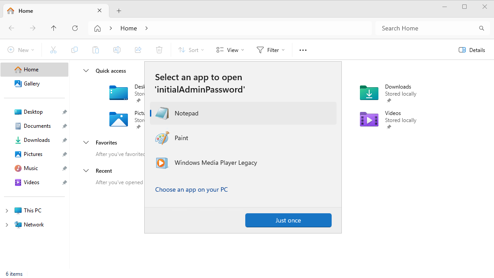

1. Inside Notepad, copy the initial admin password.

    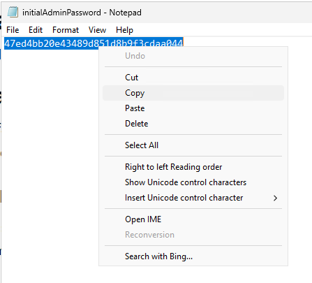

1. Complete the installation by opening a browser and connecting to localhost:8080: [http://localhost:8080](http://localhost:8080)

<!-- FooterStart -->
---
[← 01_01 System requirements](../01_01_system_requirements/README.md) | [01_03 Install Jenkins on macOS →](../01_03_install_jenkins_on_macos/README.md)
<!-- FooterEnd -->
