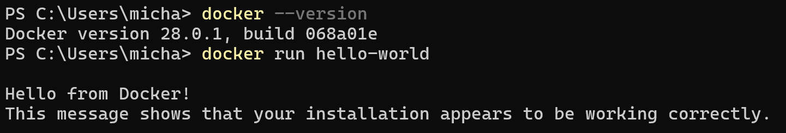
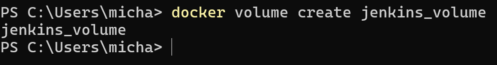
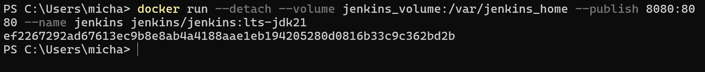
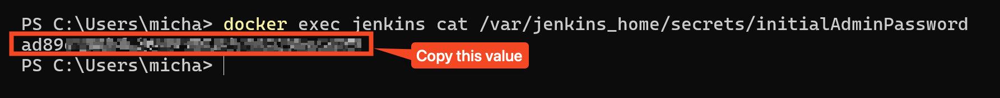

# 01_05 Install Jenkins using Docker

The Docker Desktop application allows users to run Jenkins on a variety of operating systems, including Windows, Linux, and macOS.

This guide will take you through the process of setting up a Docker-based sandbox environment for Jenkins.

*NOTE: Running Jenkins on Docker is more advanced than the other options.  If you are not already familiar with Docker, please consider one of the other options for running Jenkins.  If you want to get up to speed with installing and running Docker, please refer to the following courses from the LinkedIn Learning library:*

- [Learning Docker](https://www.linkedin.com/learning/learning-docker-17236240/install-docker-on-windows-with-docker-desktop)
- [Docker for Windows](https://www.linkedin.com/learning/docker-for-windows/why-you-need-docker-containers)

## **Prerequisites**

1. **Administrator or root privileges**: Depending on your operating system, you may need administrative or root privileges to install Docker Desktop and run Docker containers.
2. **Enough RAM and disk space**: Make sure you have enough free disk space to store the Jenkins container and any other files or data that may be created during the installation process.
   1. At least **4 GB of RAM** or more
   2. At least **10 GB** of disk space or more
3. **Basic knowledge of containerization**: While not necessary, having a basic understanding of what containers are and how they work will be helpful in getting the most out of this guide.

## **Install Docker Desktop**

The [Docker Desktop](https://docs.docker.com/desktop/) application provides a runtime environment for docker images on your local system.  Installing Docker Desktop also installs command line applications we can use to start a Jenkins process from the terminal.

1. Use the following links to download and install the appropriate version of Docker Desktop for your system:
   1. [Install Docker Desktop on Windows](https://docs.docker.com/desktop/setup/install/windows-install/)
   2. [Install Docker Desktop on macOS](https://docs.docker.com/desktop/setup/install/mac-install/)
   3. [Install Docker Desktop on Linux](https://docs.docker.com/desktop/setup/install/linux/)
2. After the installation completes, open a terminal window on your system.
3. In the terminal, run the following commands:

   ```bash
   docker --version
   docker run hello-world
   ```

   The output should be similar to the following:

   

## Pull the jenkins:lts-jdk21 image

The `jenkins:lts-jdk21` image contains all the software and dependencies needed to run Jenkins.  Specifically, this version is the Long Term Support (LTS) version that includes the Java 21 development kit and runtime engine.

In your terminal, run the following command:

`docker pull jenkins/jenkins:lts-jdk21`


## Create a volume for Jenkins data

You can use a Docker volume to save configuration data associated with a Jenkins container.  Without a volume, any users, jobs, or other data you create on a Jenkins container will be lost when the container stops running.

In your terminal, run the following command:

`docker volume create jenkins_volume`



## Use the image and volume to run a container

With the image and volume in place, you can run a Jenkins container.

In your terminal, run the following command:

```bash
docker run --detach \
    --volume jenkins_volume:/var/jenkins_home \
    --publish 8080:8080 \
    --name jenkins \
    jenkins/jenkins:lts-jdk21
```



Here's a breakdown of the Docker command:

1. **`docker run`**: The base command to create and start a new Docker container.

2. **`--detach`**: Runs the container in the background (detached mode) and returns the container ID.

3. **`--volume jenkins_volume:/var/jenkins_home`**: Creates a volume mapping between the Docker host and container:

   - `jenkins_volume` is the volume name on the host
   - `/var/jenkins_home` is the path inside the container where Jenkins stores its data

4. **`--publish 8080:8080`**: Maps port 8080 from the container to port 8080 on the host machine, allowing access to the Jenkins web interface.

5. **`--name jenkins`**: Assigns the name "jenkins" to the container for easy reference.

6. **`jenkins/jenkins:lts-jdk21`**: Specifies the Docker image to use:

   - `jenkins/jenkins` is the image repository
   - `lts-jdk21` is the specific tag (Jenkins LTS version with JDK 21\)

## Get the initial administrator password

After setting up a new Jenkins container, you need to retrieve the initial administrator password to complete the Jenkins setup process. This password is automatically generated during the first Jenkins startup and is required to unlock the Jenkins installation before you can create your own admin user.

When you run the following command in your terminal, it will output the password string, which you can then copy and paste into the Jenkins setup page when prompted for the "Administrator password":

`docker exec jenkins cat /var/jenkins_home/secrets/initialAdminPassword`



Here's a breakdown of this Docker command:

1. **`docker exec`**: This command allows you to execute a command inside a running container.
2. **`jenkins`**: The name of the target container where the command will be executed (the one you created with your previous `docker run` command).
3. **`cat /var/jenkins_home/secrets/initialAdminPassword`**: The command to execute inside the container:

- `cat`: the Unix command that displays the contents of a file
- `/var/jenkins_home/secrets/initialAdminPassword`: the path to the file containing the randomly generated initial admin password

### Complete the installation process in your browser

Complete the installation by opening a browser and connecting to the system's local address using port 8080:  [http://localhost:8080](http://localhost:8080)

<!-- FooterStart -->
---
[← 01_04 Install Jenkins on Ubuntu](../01_04_install_jenkins_on_ubuntu/README.md) | [01_06 Finish a Jenkins installation →](../01_06_finish_a_jenkins_installation/README.md)
<!-- FooterEnd -->
