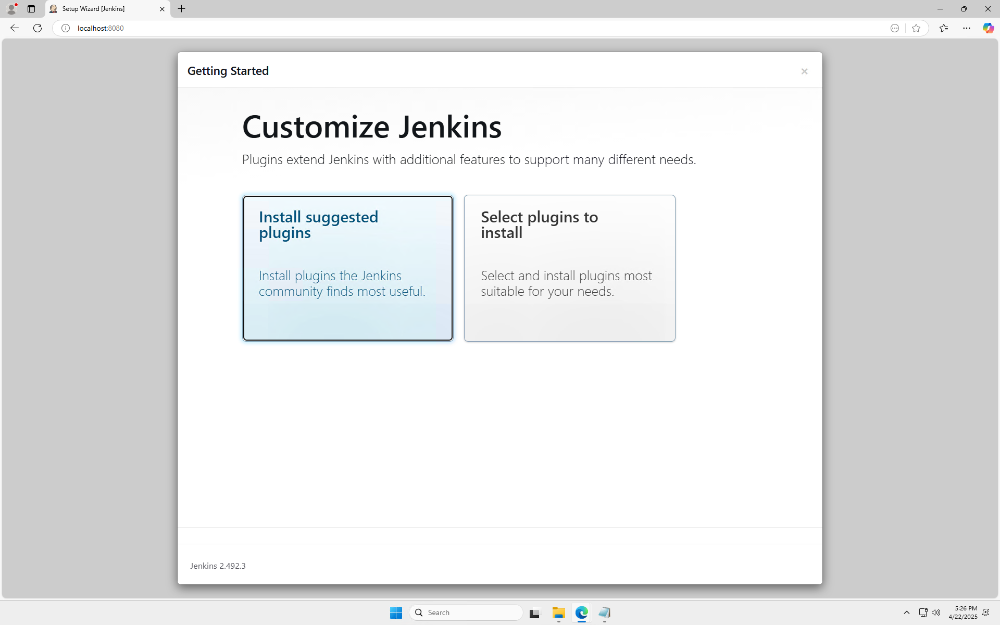
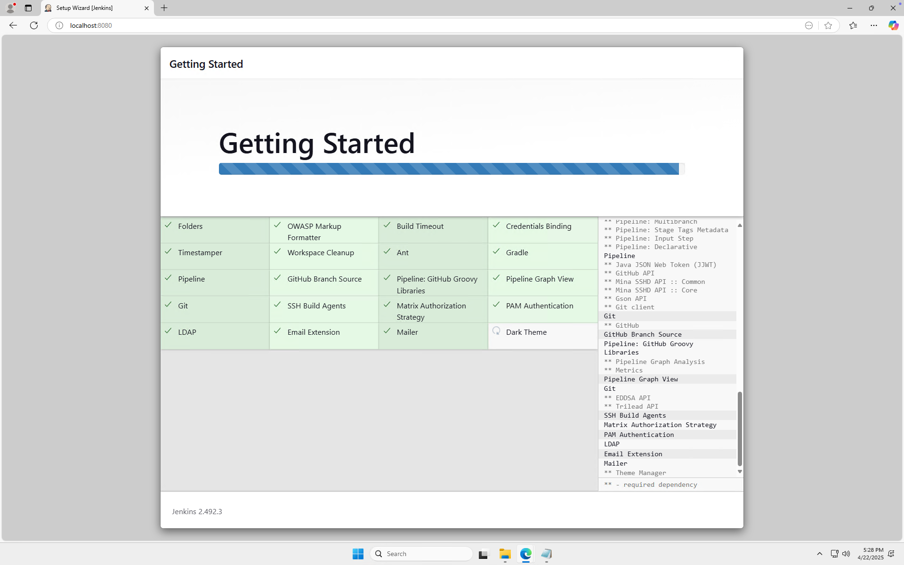
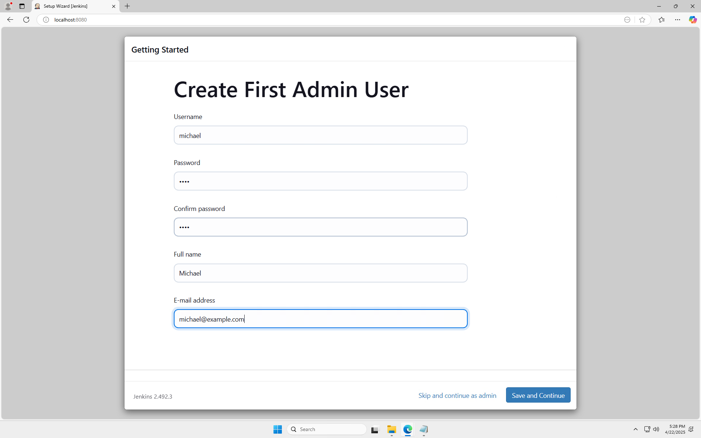
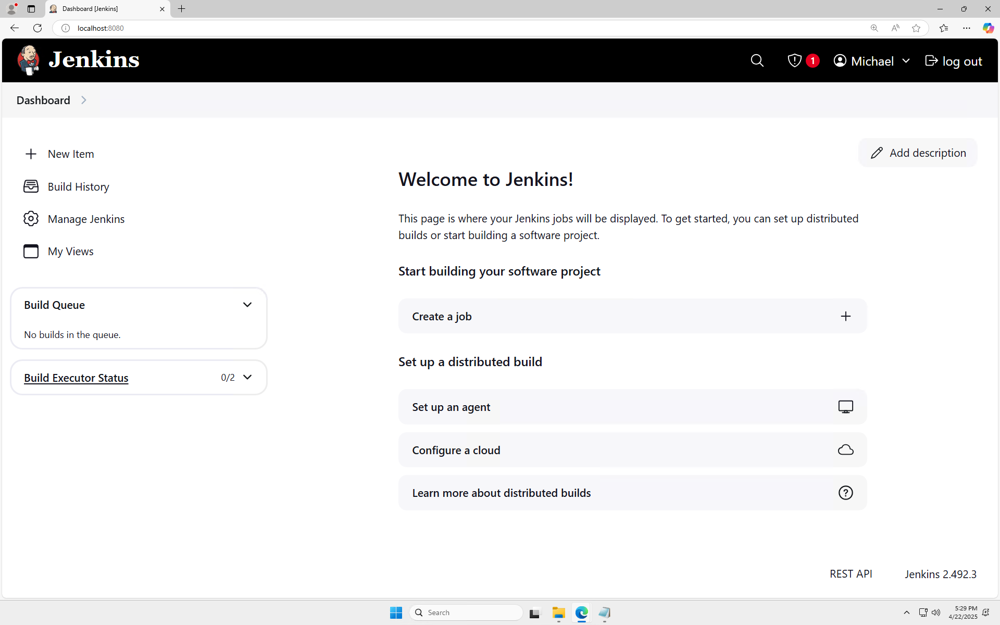
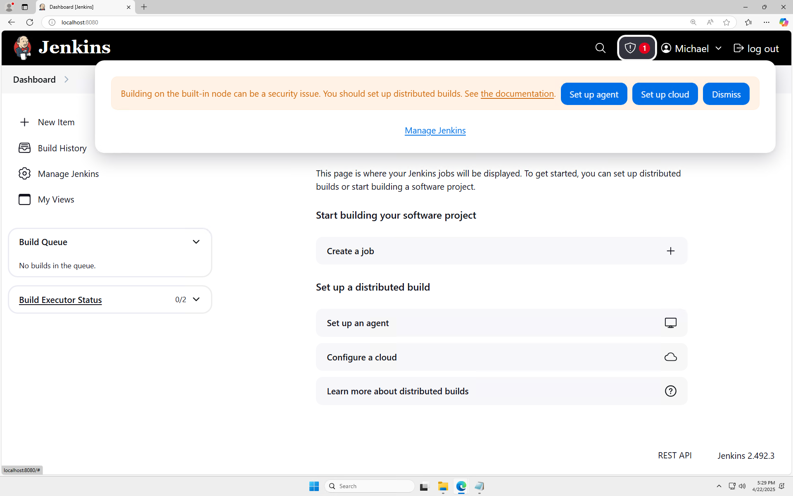

# 01_06 Finish a Jenkins installation

After installing Jenkins, you'll need to complete a few more steps to get it up and running. This guide will walk you through the final installation steps.

## Step 1: Unlock Jenkins

When you first access Jenkins, you'll be prompted to unlock it using the initial administrator password. This password was generated during installation and can be found in the location shown on the unlock screen.

## Step 2: Install Suggested Plugins

Jenkins will present you with two options for plugin installation. The recommended approach is to install the suggested plugins, which include essential tools for building, deploying, and automating your projects.

## Step 3: Create Admin User

Next, you'll need to create your first administrator user. This account will have full access to manage Jenkins and its configurations.

## Step 4: Configure Jenkins URL

Set up the Jenkins URL that will be used to access your Jenkins instance. This is typically the same URL you used to access the unlock page.

## Step 5: Start Using Jenkins

Once the installation is complete, you'll see the Jenkins dashboard. This is your main interface for managing jobs, builds, and system configurations.

## Step 6: Verify Installation

You can verify your installation by checking the system information and installed plugins in the Jenkins management interface.

## Step 7: Configure Global Tools

Set up any global tools you'll need for your builds, such as JDK, Git, or Maven installations.

## Step 8: Ready to Use

Your Jenkins installation is now complete and ready to use! You can start creating your first job or explore the various features available.

<!-- FooterStart -->
---
[← 01_05 Install Jenkins using Docker](../01_05_install_jenkins_using_docker/README.md) | [01_07 The Jenkins user interface →](../01_07_the_jenkins_user_interface/README.md)
<!-- FooterEnd -->
